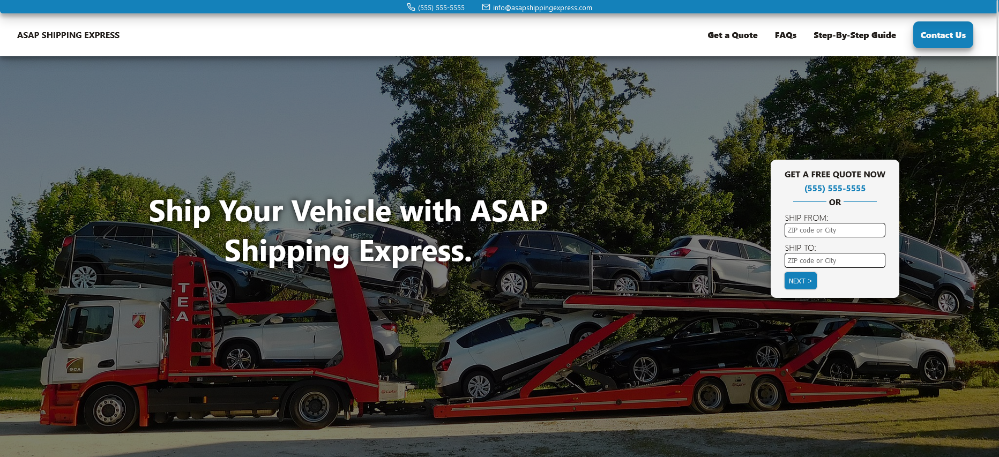

##ASAP Auto Shipping (Imaginary Company Name)

Fully responsive Logistics web site.

## Table of contents
- [Overview](#overview)
  - [The features](#the-features)
  - [Screenshot](#screenshot)
  - [Links](#links)
- [Built with](#built-with)
- [Author](#author)

## Overview

### The features

Users are be able to:

- View the optimal layout for the app depending on their device's screen size
- See hover states for all interactive elements on the page
- Navigate to multiple pages
- Navigate through visual menu for US states
- Request online quote for transport a vehicle
- Send message to busines owners on Contact Us page

### Screenshot

### Links

- Live Site URL: [Live site URL here](https://your-live-site-url.com)

### Built with

- Semantic HTML5 markup
- Flexbox
- Mobile-first workflow
- [React](https://reactjs.org/) - JS library
- Framer Motion

## Author

- Frontend Mentor - [@Vali-Ruziboev](https://www.frontendmentor.io/profile/Vali-Ruziboev)
- Instagram - [valiruziboev](https://www.instagram.com/vali_ruziboev/)
- Linkedin - [Vali Ruziboev](https://www.linkedin.com/in/vali-ruziboev/)
